<h1>🏚😊 혼자랑 😊🏚</h1>

## 📢 서비스 소개

자취생들을 위한 네트워크 형성을 목적으로 한 웹 커뮤니티

##### 혼자랑 UCC

##### [혼자랑 바로가기](http://honjarang.kro.kr/)

## 🤔 기획 배경

1인 가구의 증가하는 현실 속에서 그들의 불편함을 듣게 되었습니다.
배송비 및 배달비의 부담, 도움 요청의 어려움, 타지 생활로 인한 외로움 등이 주요 고민이었습니다.
**혼자랑**은 편리한 서비스를 가진 커뮤니티로서, 자취생들의 삶의 질 향상에 기여하고자 하였습니다.

## 💻 주요 기능

1. 화상 채팅 서비스(혼밥/술, 도움, 자유, 게임, 스터디)

2. 공동배달 및 공동구매 모집 기능, 중고거래 기능 (장터)

3. 장터에서 사용가능한 실시간 채팅 기능

4. 1인 가구를 위한 꿀팁 및 게시판 기능

5. 위치기반 편의시설 확인 기능 

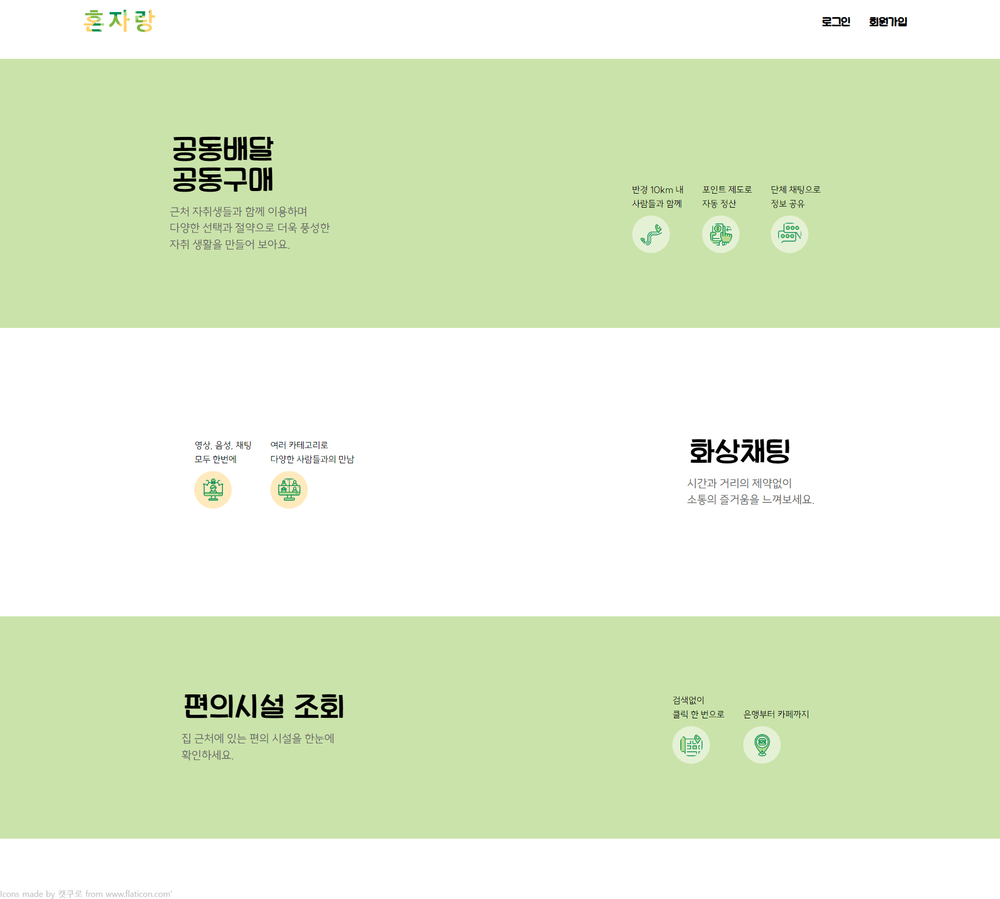

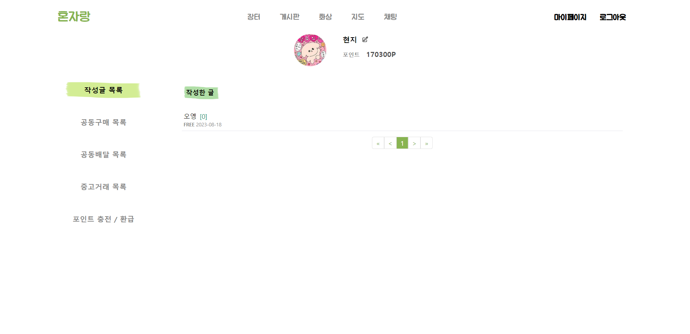

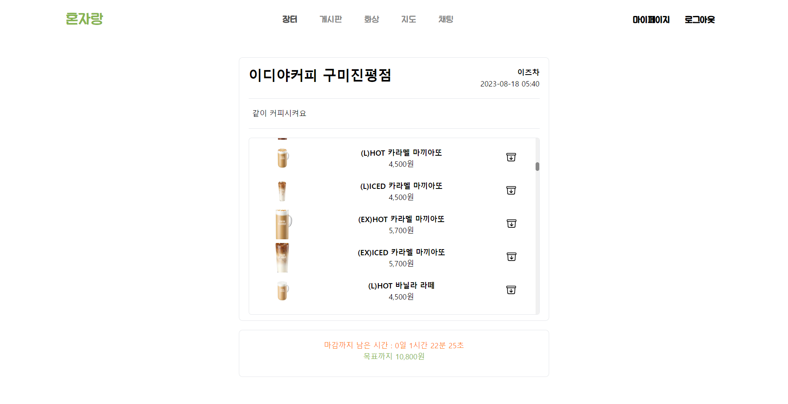

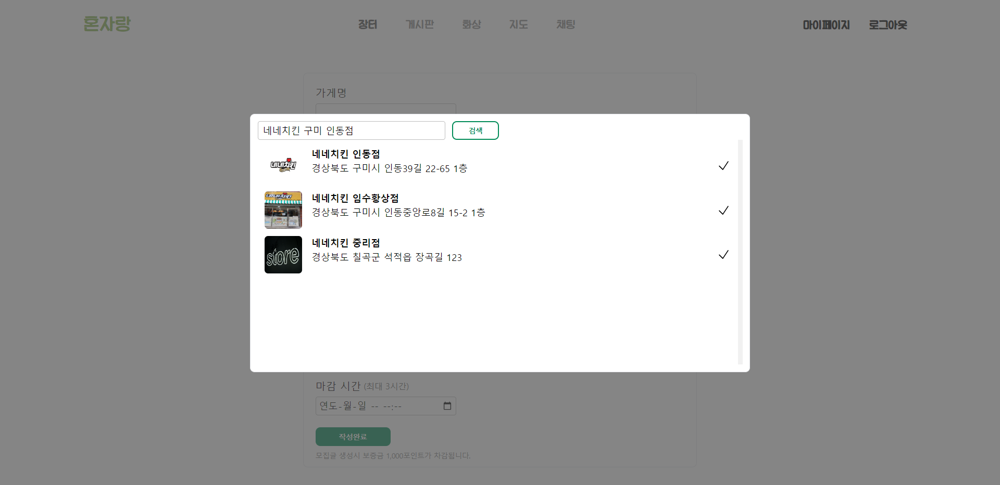

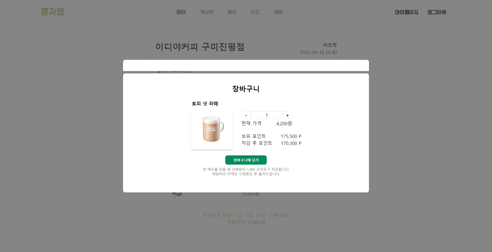

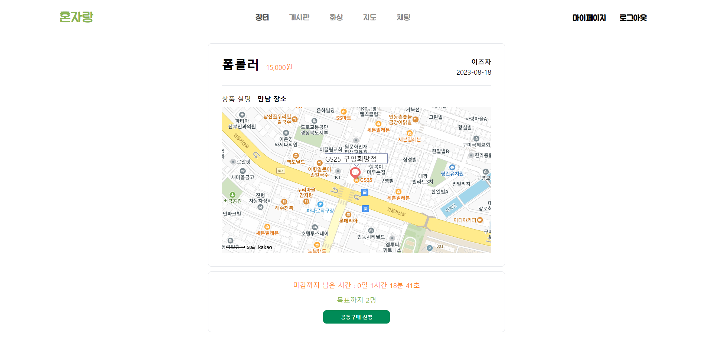

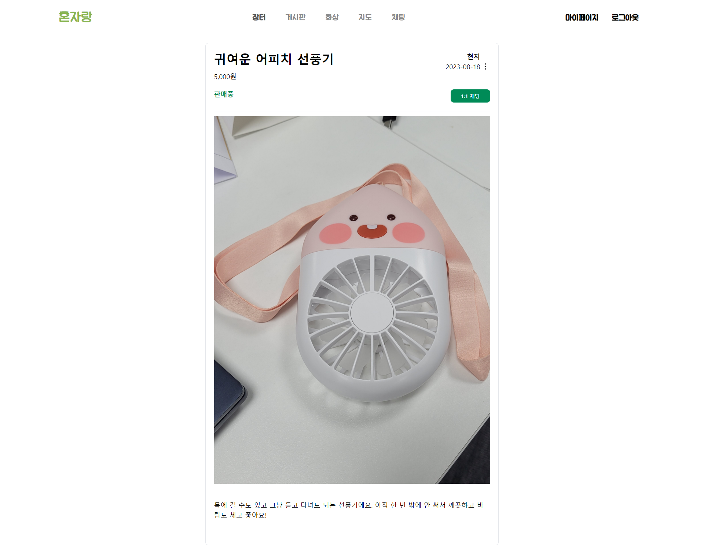

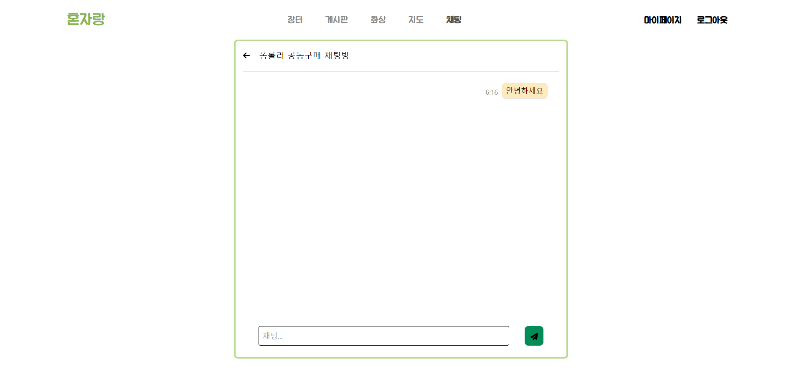

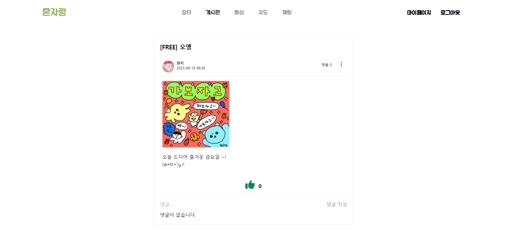

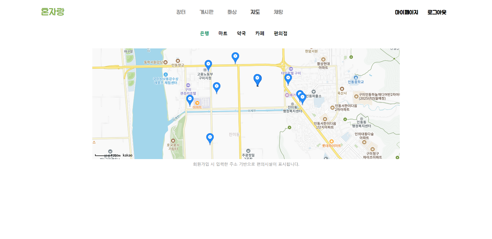

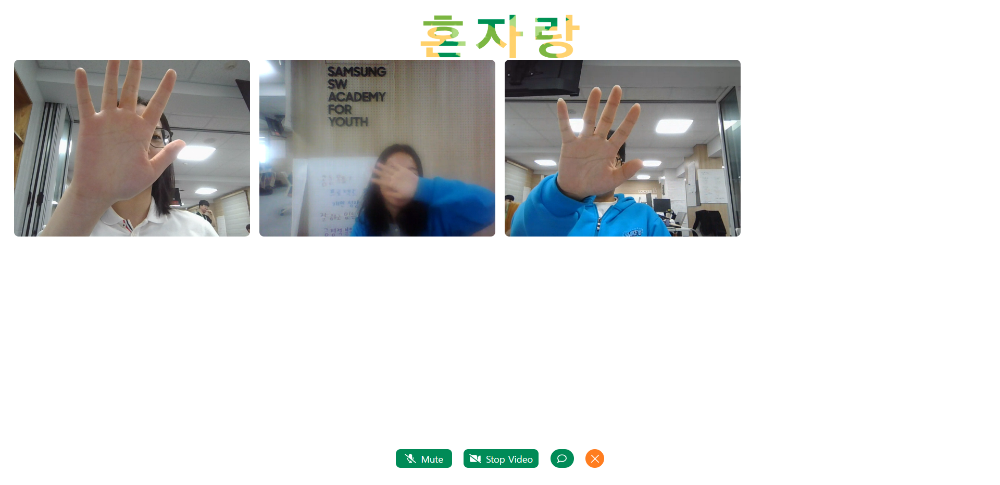

## 📜 시연 시나리오

#### 공동 배달

- 모집자가 공동 배달 할 가게와 최소 목표금액, 배달비 등을 설정해서 글 작성을 합니다.
- 사용자는 회원가입 시 입력한 주소의 10km 반경 이내의 공동 배달을 모집하는 가게들의 글을 볼 수 있습니다. 
- 원하는 가게가 있다면 참여하기 버튼을 통해 모집자가 작성한 글의 상세페이지에 갈 수 있습니다.
- 사용자는 메뉴 리스트에서 원하는 메뉴를 선택하여  수량을 정해 장바구니에 담을 수 있습니다.
- 이때 가격*수량만큼의 포인트가 차감되므로 포인트가 부족할 경우엔 장바구니에 담을 수 없습니다.
- 동일한 글에서 장바구니에 처음 메뉴를 담을 때만 선배달비 1,000포인트가 차감됩니다.
- 이때 글 작성자의 경우엔 장바구니에 메뉴를 담아도 포인트가 차감되지 않습니다.
- 메뉴를 담은 참여자들만 장바구니 목록 조회가 가능합니다.
- 장바구니 목록에서 메뉴별 삭제가 가능합니다.
- 목표 금액 달성 후 마감시간이 끝나면 글 작성자는 메뉴 리스트를 보고 주문합니다.
- 참여자들은 채팅을 통해 다 같이 정확한 수령 장소 및 시간을 정하며 대화를 나눌 수 있습니다.
- 수령 후 작성자 제외 수령확인 버튼을 누르면 글 작성자에게 주문한 모든 메뉴만큼의 포인트가 충전됩니다.
- 참여자들은 화상채팅 방을 만들어 함께 얘기하며 식사를 즐길 수 있습니다.

#### 공동 구매

- 모집자가 공동 구매할 상품과 목표 금액을 설정해서 글 작성을 합니다.
- 사용자는 회원가입 시 입력한 주소의 10km 반경 이내의 공동 구매를 모집하는 글을 볼 수 있습니다.
- 사용자는 상품 설명과 지도에서 만남 장소가 확인 가능합니다.
- 원하는 상품이 있다면 참여하기 버튼을 통해 모집자가 작성한 글의 상세페이지에 갈 수 있습니다.
- 사용자는 수량을 정해 구매를 할 수 있으며 보유 포인트가 (상품*수량) + (배송비/목표인원) 보다 많아야 구매가 가능합니다.
- 참여자는 구매를 하면 참여자 목록 확인이 가능합니다.
- 목표 인원 달성 후 마감시간이 끝나면 글 작성자는 수량을 보고 주문합니다.
- 참여자는 채팅을 통해 다 같이 정확한 시간을 정하며 대화를 나눌 수 있습니다.
- 수령 후 작성자 제외 수령확인 버튼을 누르면 글 작성자에게 수량만큼의 포인트가 충전됩니다.

#### 중고 거래

- 구매자는 참여하기 버튼을 통해 판매자가 작성한 글을 보고 1 대 1 채팅을 할 수 있습니다.
- 구매자가 구매를 하면 판매 완료로 바뀝니다.

#### 채팅

- 1 대1 채팅과 단체 채팅이 있습니다.
- 다른 사용자의 닉네임을 누르면 사용자 페이지로 가며 채팅 버튼을 눌러 1 대 1로 채팅이 가능합니다.
- 공동배달, 공동구매 참여시 단체 채팅이 가능합니다.
- 채팅 목록 확인이 가능하며 목록에서 미확인한 채팅방에는 확인 못한 메시지 개수가 표시됩니다.
- 다른 창에 있을 경우 크롬에서 채팅 알림이 나와 놓치지 않고 채팅 이용이 가능합니다.

#### 화상채팅

- 화상채팅 카테고리에는 자유, 도와주세요, 혼밥/혼술, 게임, 스터디가 있습니다.
- 방은 선택한 카테고리가 위치하는 곳에 생성됩니다.
- 최대 8명이서 가능합니다.
- 화상 채팅방에서는 음성 on/off, 카메라 on/off가 가능하며 실시간 채팅을 통해서도 즐길 수 있습니다. 

#### 게시판

- 게시판 카테고리에는 자유, 꿀팁이 있습니다.
- 사용자들은 각 카테고리에 맞는 글을 작성하고 볼 수 있습니다.
- 작성자는 글 수정, 삭제가 가능합니다.
- 사용자는 좋아요, 댓글 쓰기 및 삭제가 가능합니다.
- 검색어 입력으로 제목에서 같은 키워드가 있을 경우 검색이 가능합니다.
- 관리자는 게시글 중에서 공지로 등록할 수 있으며 등록한 글은 게시글 목록에서 최상단에 위치하게 됩니다.

#### 지도

- 지도에서는 사용자가 회원가입 시 입력한 위치 기반으로 편의시설 조회가 가능합니다.
- 은행, 마트, 약국, 카페, 편의점 조회가 가능하며 한 번에 15개씩 볼 수 있습니다.

## 📚 기술 스택

Backend

  <ul>
    <li>Ubuntu 20.04 LTS</li>  
    <li>Java 17</li> 
    <li>Spring Boot 3.1.1</li> 
    <li>MySQL 8.0.34</li> 
    <li>MongoDB 6.0.8</li> 
    <li>Redis 6.2.6 e</li> 
    <li>RabbitMQ 3.13.0</li> 
    <li>OpenVidu 2.28.0</li> 
  </ul>
  

Frontend

  <ul>
    <li>React 18.2.0</li>  
    <li>Redux 4.2.1</li> 
    <li>Redux Toolkit 1.9.5</li> 
    <li>OpenVidu 2.28.0/li> 
    <li>stompjs 2.3.3</li> 
    <li>tailwind CSS</li> 
  </ul>
  

IDE

  <ul>
    <li>IntelliJ IDEA Ultimate 2023.2</li>  
    <li>Visual Studio Code 1.81</li> 
  </ul>
  

CI/CD

  <ul>
    <li>Jenkins 2.419</li>  
    <li>Nginx 1.25.1</li> 
    <li>AWS EC2</li> 
    <li>OpenVidu 2.28.0/li> 
    <li>SSL</li> 
    <li>Docker</li> 
  </ul>
  

##

## 🗂 파일 구조

  VS Code - Extenstions에서 "file-tree-generator" 검색 후 install
  원하는 폴더 우클릭 후 [Generate to Tree] 클릭!
  백엔드 해야함

Backend

<pre><code>
+---main
|   +---generated
|   +---java
|   |   \---com
|   |       \---example
|   |           \---honjarang
|   |               |   HonJaRangApplication.java
|   |               |   
|   |               +---config
|   |               |       AwsS3Config.java
|   |               |       AwsSesConfig.java
|   |               |       FCMConfig.java
|   |               |       JpaConfig.java
|   |               |       MongoTemplateConfig.java
|   |               |       RabbitMQConfig.java
|   |               |       RedisConfig.java
|   |               |       RestTemplateConfig.java
|   |               |       WebConfig.java
|   |               |       WebSocketConfig.java
|   |               |       
|   |               +---domain
|   |               |   |   BaseTimeEntity.java
|   |               |   |   DateTimeUtils.java
|   |               |   |   TimeController.java
|   |               |   |   
|   |               |   +---chat
|   |               |   |   +---controller
|   |               |   |   |       ChatController.java
|   |               |   |   |       
|   |               |   |   +---document
|   |               |   |   |       ChatMessage.java
|   |               |   |   |       
|   |               |   |   +---dto
|   |               |   |   |       ChatMessageCreateDto.java
|   |               |   |   |       ChatMessageListDto.java
|   |               |   |   |       ChatMessageSendDto.java
|   |               |   |   |       ChatRoomListDto.java
|   |               |   |   |       
|   |               |   |   +---entity
|   |               |   |   |       ChatParticipant.java
|   |               |   |   |       ChatRoom.java
|   |               |   |   |       
|   |               |   |   +---exception
|   |               |   |   |       ChatParticipantNotFoundException.java
|   |               |   |   |       ChatRoomNotFoundException.java
|   |               |   |   |       
|   |               |   |   +---listener
|   |               |   |   |       ChatMessageListener.java
|   |               |   |   |       
|   |               |   |   +---repository
|   |               |   |   |       ChatMessageRepository.java
|   |               |   |   |       ChatParticipantRepository.java
|   |               |   |   |       ChatRoomRepository.java
|   |               |   |   |       
|   |               |   |   \---service
|   |               |   |           ChatService.java
|   |               |   |           
|   |               |   +---jointdelivery
|   |               |   |   +---controller
|   |               |   |   |       JointDeliveryController.java
|   |               |   |   |       JointDeliveryControllerAdvice.java
|   |               |   |   |       
|   |               |   |   +---document
|   |               |   |   |       Menu.java
|   |               |   |   |       
|   |               |   |   +---dto
|   |               |   |   |       JointDeliveryApplicantListDto.java
|   |               |   |   |       JointDeliveryCartCreateDto.java
|   |               |   |   |       JointDeliveryCartListDto.java
|   |               |   |   |       JointDeliveryCreateDto.java
|   |               |   |   |       JointDeliveryDto.java
|   |               |   |   |       JointDeliveryListDto.java
|   |               |   |   |       MenuListDto.java
|   |               |   |   |       StoreDto.java
|   |               |   |   |       StoreListDto.java
|   |               |   |   |       
|   |               |   |   +---entity
|   |               |   |   |       JointDelivery.java
|   |               |   |   |       JointDeliveryApplicant.java
|   |               |   |   |       JointDeliveryCart.java
|   |               |   |   |       Store.java
|   |               |   |   |       
|   |               |   |   +---exception
|   |               |   |   |       InsufficientPriceException.java
|   |               |   |   |       JointDeliveryAlreadyReceivedException.java
|   |               |   |   |       JointDeliveryApplicantNotFoundException.java
|   |               |   |   |       JointDeliveryCanceledException.java
|   |               |   |   |       JointDeliveryCartAccessException.java
|   |               |   |   |       JointDeliveryCartNotFoundException.java
|   |               |   |   |       JointDeliveryExpiredException.java
|   |               |   |   |       JointDeliveryNotClosedException.java
|   |               |   |   |       JointDeliveryNotFoundException.java
|   |               |   |   |       MenuNotFoundException.java
|   |               |   |   |       StoreNotFoundException.java
|   |               |   |   |       UnauthorizedJointDeliveryAccessException.java
|   |               |   |   |       
|   |               |   |   +---repository
|   |               |   |   |       JointDeliveryApplicantRepository.java
|   |               |   |   |       JointDeliveryCartRepository.java
|   |               |   |   |       JointDeliveryRepository.java
|   |               |   |   |       MenuRepository.java
|   |               |   |   |       StoreRepository.java
|   |               |   |   |       
|   |               |   |   \---service
|   |               |   |           JointDeliveryService.java
|   |               |   |           
|   |               |   +---jointpurchase
|   |               |   |   +---controller
|   |               |   |   |       JointProductControllerAdvice.java
|   |               |   |   |       JointPurchaseController.java
|   |               |   |   |       
|   |               |   |   +---dto
|   |               |   |   |       JointPurchaseApplicantListDto.java
|   |               |   |   |       JointPurchaseApplyDto.java
|   |               |   |   |       JointPurchaseCreateDto.java
|   |               |   |   |       JointPurchaseDto.java
|   |               |   |   |       JointPurchaseListDto.java
|   |               |   |   |       
|   |               |   |   +---entity
|   |               |   |   |       JointPurchase.java
|   |               |   |   |       JointPurchaseApplicant.java
|   |               |   |   |       
|   |               |   |   +---exception
|   |               |   |   |       InsufficientPersonCountException.java
|   |               |   |   |       JointPurchaseAlreadyAppliedException.java
|   |               |   |   |       JointPurchaseAlreadyReceivedException.java
|   |               |   |   |       JointPurchaseApplicantNotFoundException.java
|   |               |   |   |       JointPurchaseCanceledException.java
|   |               |   |   |       JointPurchaseExpiredException.java
|   |               |   |   |       JointPurchaseNotClosedException.java
|   |               |   |   |       JointPurchaseNotFoundException.java
|   |               |   |   |       ProductNotFoundException.java
|   |               |   |   |       UnauthorizedJointPurchaseAccessException.java
|   |               |   |   |       
|   |               |   |   +---repository
|   |               |   |   |       JointPurchaseApplicantRepository.java
|   |               |   |   |       JointPurchaseRepository.java
|   |               |   |   |       
|   |               |   |   \---service
|   |               |   |           JointPurchaseService.java
|   |               |   |           
|   |               |   +---map
|   |               |   |   +---controller
|   |               |   |   |       MapController.java
|   |               |   |   |       MapControllerAdvice.java
|   |               |   |   |       
|   |               |   |   +---dto
|   |               |   |   |       CoordinateDto.java
|   |               |   |   |       
|   |               |   |   +---exception
|   |               |   |   |       PlaceNotFoundException.java
|   |               |   |   |       
|   |               |   |   \---service
|   |               |   |           MapService.java
|   |               |   |           
|   |               |   +---post
|   |               |   |   +---controller
|   |               |   |   |       PostController.java
|   |               |   |   |       
|   |               |   |   +---dto
|   |               |   |   |       CommentCreateDto.java
|   |               |   |   |       CommentListDto.java
|   |               |   |   |       PostCreateDto.java
|   |               |   |   |       PostDto.java
|   |               |   |   |       PostListDto.java
|   |               |   |   |       PostUpdateDto.java
|   |               |   |   |       
|   |               |   |   +---entity
|   |               |   |   |       Category.java
|   |               |   |   |       Comment.java
|   |               |   |   |       LikePost.java
|   |               |   |   |       Post.java
|   |               |   |   |       
|   |               |   |   +---exception
|   |               |   |   |       CommentNotFoundException.java
|   |               |   |   |       ContentEmptyException.java
|   |               |   |   |       InvalidUserException.java
|   |               |   |   |       PaymentException.java
|   |               |   |   |       PostNotFoundException.java
|   |               |   |   |       TitleAndContentEmptyException.java
|   |               |   |   |       TitleEmptyException.java
|   |               |   |   |       
|   |               |   |   +---repository
|   |               |   |   |       CommentRepository.java
|   |               |   |   |       LikePostRepository.java
|   |               |   |   |       PostRepository.java
|   |               |   |   |       
|   |               |   |   \---service
|   |               |   |           PostService.java
|   |               |   |           
|   |               |   +---secondhand
|   |               |   |   +---controller
|   |               |   |   |       TransactionController.java
|   |               |   |   |       
|   |               |   |   +---dto
|   |               |   |   |       TransactionCreateDto.java
|   |               |   |   |       TransactionDto.java
|   |               |   |   |       TransactionListDto.java
|   |               |   |   |       TransactionUpdateDto.java
|   |               |   |   |       
|   |               |   |   +---entity
|   |               |   |   |       Transaction.java
|   |               |   |   |       
|   |               |   |   +---exception
|   |               |   |   |       TransactionException.java
|   |               |   |   |       
|   |               |   |   +---repository
|   |               |   |   |       TransactionRepository.java
|   |               |   |   |       
|   |               |   |   \---service
|   |               |   |           TransactionService.java
|   |               |   |           
|   |               |   +---secondhandtransaction
|   |               |   |   +---controller
|   |               |   |   |       SecondhandTransactionController.java
|   |               |   |   |       
|   |               |   |   +---dto
|   |               |   |   |       SecondhandTranscationCreateDto.java
|   |               |   |   |       
|   |               |   |   +---entity
|   |               |   |   |       SecondhandTransaction.java
|   |               |   |   |       
|   |               |   |   +---repository
|   |               |   |   |       SecondhandTransactionRepository.java
|   |               |   |   |       
|   |               |   |   \---service
|   |               |   |           SecondhandTransactionService.java
|   |               |   |           
|   |               |   +---user
|   |               |   |   +---controller
|   |               |   |   |       UserController.java
|   |               |   |   |       UserControllerAdvice.java
|   |               |   |   |       
|   |               |   |   +---dto
|   |               |   |   |       LoginDto.java
|   |               |   |   |       PasswordSetDto.java
|   |               |   |   |       PasswordUpdateDto.java
|   |               |   |   |       PointChargeDto.java
|   |               |   |   |       PointWithdrawDto.java
|   |               |   |   |       UserCreateDto.java
|   |               |   |   |       UserInfoDto.java
|   |               |   |   |       UserInfoUpdateDto.java
|   |               |   |   |       VerifyCodeDto.java
|   |               |   |   |       
|   |               |   |   +---entity
|   |               |   |   |       EmailVerification.java
|   |               |   |   |       Role.java
|   |               |   |   |       User.java
|   |               |   |   |       
|   |               |   |   +---exception
|   |               |   |   |       DuplicateEmailException.java
|   |               |   |   |       DuplicateNicknameException.java
|   |               |   |   |       EmailAlreadyVerifiedException.java
|   |               |   |   |       EmailNotVerifiedException.java
|   |               |   |   |       InsufficientPointsException.java
|   |               |   |   |       PasswordMismatchException.java
|   |               |   |   |       UserNotFoundException.java
|   |               |   |   |       VerificationCodeExpiredException.java
|   |               |   |   |       VerificationCodeMismatchException.java
|   |               |   |   |       VerificationCodeNotFoundException.java
|   |               |   |   |       
|   |               |   |   +---repository
|   |               |   |   |       EmailVerificationRepository.java
|   |               |   |   |       UserRepository.java
|   |               |   |   |       
|   |               |   |   \---service
|   |               |   |           EmailService.java
|   |               |   |           UserService.java
|   |               |   |           
|   |               |   \---videochat
|   |               |       +---controller
|   |               |       |       VideoChatController.java
|   |               |       |       
|   |               |       +---dto
|   |               |       |       VideoChatListDto.java
|   |               |       |       VideoChatParticipantCreateDto.java
|   |               |       |       VideoChatRoomCreateDto.java
|   |               |       |       
|   |               |       +---entity
|   |               |       |       Category.java
|   |               |       |       VideoChatParticipant.java
|   |               |       |       VideoChatRoom.java
|   |               |       |       
|   |               |       +---exception
|   |               |       |       ExistVideoChatException.java
|   |               |       |       
|   |               |       +---repository
|   |               |       |       VideoChatParticipantRepository.java
|   |               |       |       VideoChatRoomRepository.java
|   |               |       |       
|   |               |       \---service
|   |               |               VideoChatService.java
|   |               |               
|   |               \---security
|   |                   |   CurrentUser.java
|   |                   |   
|   |                   +---config
|   |                   |       SecurityConfig.java
|   |                   |       
|   |                   +---dto
|   |                   |       TokenDto.java
|   |                   |       
|   |                   +---exception
|   |                   |       InvalidTokenException.java
|   |                   |       TokenExpiredException.java
|   |                   |       
|   |                   +---filter
|   |                   |       JwtAuthFilter.java
|   |                   |       
|   |                   \---service
|   |                           TokenService.java
|   |                           
|   \---resources
|       |   application-dev.properties
|       |   application-prod.properties
|       |   application-secret.properties
|       |   application.properties
|       |   
|       \---static
|           \---docs
|                   chats.html
|                   index.html
|                   joint-deliveries.html
|                   joint-purchases.html
|                   maps.html
|                   posts.html
|                   transaction.html
|                   users.html
|                   
\---test
    +---java
    |   \---com
    |       \---example
    |           \---honjarang
    |               +---domain
    |               |   +---chat
    |               |   |   +---controller
    |               |   |   |       ChatControllerTest.java
    |               |   |   |       
    |               |   |   \---service
    |               |   |           ChatServiceTest.java
    |               |   |           
    |               |   +---jointdelivery
    |               |   |   +---controller
    |               |   |   |       JointDeliveryControllerTest.java
    |               |   |   |       
    |               |   |   \---service
    |               |   |           JointDeliveryServiceTest.java
    |               |   |           
    |               |   +---jointpurchase
    |               |   |   +---controller
    |               |   |   |       JointPurchaseControllerTest.java
    |               |   |   |       
    |               |   |   \---service
    |               |   |           JointPurchaseServiceTest.java
    |               |   |           
    |               |   +---map
    |               |   |   +---controller
    |               |   |   |       MapControllerTest.java
    |               |   |   |       
    |               |   |   \---service
    |               |   |           MapServiceTest.java
    |               |   |           
    |               |   +---post
    |               |   |   +---controller
    |               |   |   |       PostControllerTest.java
    |               |   |   |       
    |               |   |   \---service
    |               |   |           PostServiceTest.java
    |               |   |           
    |               |   +---secondhand
    |               |   |   +---controller
    |               |   |   |       TransactionControllerTest.java
    |               |   |   |       
    |               |   |   \---service
    |               |   |           TransactionServiceTest.java
    |               |   |           
    |               |   +---user
    |               |   |   +---controller
    |               |   |   |       UserControllerTest.java
    |               |   |   |       
    |               |   |   \---service
    |               |   |           EmailServiceTest.java
    |               |   |           UserServiceTest.java
    |               |   |           
    |               |   \---videochat
    |               |       \---controller
    |               |               VideoChatControllerTest.java
    |               |               
    |               \---security
    |                   \---service
    |                           TokenServiceTest.java
    |                           
    \---resources
        |   application.properties
        |   
        \---org
            \---springframework
                \---restdocs
                    \---templates
                            path-parameters.snippet
                            query-parameters.snippet
                            request-fields.snippet
                            response-fields.snippet
</code></pre>

Frontend

<pre><code>
src
 ┣ apis
 ┃ ┗ config.js
 ┣ assets
 ┃ ┣ main
 ┃ ┃ ┣ facility_food.png
 ┃ ┃ ┣ facility_map.png
 ┃ ┃ ┣ joint_chat.png
 ┃ ┃ ┣ joint_location.png
 ┃ ┃ ┣ joint_point.png
 ┃ ┃ ┣ used_chat.png
 ┃ ┃ ┣ video_all.png
 ┃ ┃ ┗ video_people.png
 ┃ ┣ 2.png
 ┃ ┣ 404.jpg
 ┃ ┣ DefaultImage.png
 ┃ ┣ default_menu.jpg
 ┃ ┣ default_store.jpg
 ┃ ┣ Highlight.png
 ┃ ┣ Highlight_green.png
 ┃ ┣ panda-bear.png
 ┃ ┗ react.svg
 ┣ components
 ┃ ┣ Board
 ┃ ┃ ┣ Article.jsx
 ┃ ┃ ┣ ArticleList.jsx
 ┃ ┃ ┣ Comment.jsx
 ┃ ┃ ┣ TextArea.jsx
 ┃ ┃ ┗ TextFields.jsx
 ┃ ┣ Chatting
 ┃ ┃ ┣ ChatList.jsx
 ┃ ┃ ┗ Talks.jsx
 ┃ ┣ Common
 ┃ ┃ ┣ Content.jsx
 ┃ ┃ ┣ Modal.jsx
 ┃ ┃ ┗ SideTab.jsx
 ┃ ┣ Header
 ┃ ┃ ┗ Header.jsx
 ┃ ┣ Market
 ┃ ┃ ┣ Delivery
 ┃ ┃ ┃ ┣ Cart.jsx
 ┃ ┃ ┃ ┣ CartList.jsx
 ┃ ┃ ┃ ┣ DeliveryList.jsx
 ┃ ┃ ┃ ┣ DeliveryRoom.jsx
 ┃ ┃ ┃ ┗ Stores.jsx
 ┃ ┃ ┣ Purchase
 ┃ ┃ ┃ ┣ PurchaseApply.jsx
 ┃ ┃ ┃ ┣ PurchaseDetailPlace.jsx
 ┃ ┃ ┃ ┣ PurchaseDetailProduct.jsx
 ┃ ┃ ┃ ┣ PurchaseList.jsx
 ┃ ┃ ┃ ┣ PurchaseMap.jsx
 ┃ ┃ ┃ ┣ PurchaserList.jsx
 ┃ ┃ ┃ ┗ PurchaseRoom.jsx
 ┃ ┃ ┣ Transaction
 ┃ ┃ ┃ ┣ TransactionList.jsx
 ┃ ┃ ┃ ┗ TransactionRoom.jsx
 ┃ ┃ ┣ pagination.css
 ┃ ┃ ┗ Rooms.jsx
 ┃ ┣ MyPage
 ┃ ┃ ┣ Charge
 ┃ ┃ ┃ ┣ Charge.jsx
 ┃ ┃ ┃ ┣ ChargeTab.jsx
 ┃ ┃ ┃ ┗ Refund.jsx
 ┃ ┃ ┣ Edit
 ┃ ┃ ┃ ┣ Address.jsx
 ┃ ┃ ┃ ┣ Edit.jsx
 ┃ ┃ ┃ ┣ ImageInput.jsx
 ┃ ┃ ┃ ┗ Nickname.jsx
 ┃ ┃ ┣ List
 ┃ ┃ ┃ ┣ Article.jsx
 ┃ ┃ ┃ ┣ ArticleList.jsx
 ┃ ┃ ┃ ┣ DeliveryList.jsx
 ┃ ┃ ┃ ┣ PurchaseList.jsx
 ┃ ┃ ┃ ┗ TransacationList.jsx
 ┃ ┃ ┣ Delivery.jsx
 ┃ ┃ ┣ MypageCss.jsx
 ┃ ┃ ┣ Purchase.jsx
 ┃ ┃ ┣ SideBar.jsx
 ┃ ┃ ┣ Tab.jsx
 ┃ ┃ ┣ Transaction.jsx
 ┃ ┃ ┗ UserInfo.jsx
 ┃ ┣ Signup
 ┃ ┃ ┣ address_check.jsx
 ┃ ┃ ┣ email_verify.jsx
 ┃ ┃ ┣ nickname_check.jsx
 ┃ ┃ ┣ Password_check.jsx
 ┃ ┃ ┣ post.css
 ┃ ┃ ┣ Post.jsx
 ┃ ┃ ┗ verify_input.jsx
 ┃ ┣ WebRTC
 ┃ ┃ ┣ Chat.jsx
 ┃ ┃ ┣ ChatList.jsx
 ┃ ┃ ┣ OvVideo.jsx
 ┃ ┃ ┣ RTC.jsx
 ┃ ┃ ┣ UserVideoComponent.jsx
 ┃ ┃ ┣ Util.jsx
 ┃ ┃ ┗ WebRTCRoom.jsx
 ┃ ┣ AuthRoute.jsx
 ┃ ┗ DefaultLayout.jsx
 ┣ pages
 ┃ ┣ Board
 ┃ ┃ ┣ ArticleCreate.jsx
 ┃ ┃ ┣ ArticleDetail.jsx
 ┃ ┃ ┣ ArticleUpdate.jsx
 ┃ ┃ ┗ Board.jsx
 ┃ ┣ Chatting
 ┃ ┃ ┣ Chat.jsx
 ┃ ┃ ┣ Chatting.jsx
 ┃ ┃ ┗ scrollbar.module.css
 ┃ ┣ Checkout
 ┃ ┃ ┣ Checkout.jsx
 ┃ ┃ ┣ Fail.jsx
 ┃ ┃ ┗ Success.jsx
 ┃ ┣ FindPassword
 ┃ ┃ ┣ ChangePassword.jsx
 ┃ ┃ ┣ FindPassword.jsx
 ┃ ┃ ┗ SetNewPassword.jsx
 ┃ ┣ login
 ┃ ┃ ┗ login.jsx
 ┃ ┣ Main
 ┃ ┃ ┗ Main.jsx
 ┃ ┣ Map
 ┃ ┃ ┣ Map.css
 ┃ ┃ ┗ Map.jsx
 ┃ ┣ Market
 ┃ ┃ ┣ DeliveryCreate.jsx
 ┃ ┃ ┣ DeliveryDetail.jsx
 ┃ ┃ ┣ Market.jsx
 ┃ ┃ ┣ PurchaseCreate.jsx
 ┃ ┃ ┣ PurchaseDetail.jsx
 ┃ ┃ ┣ TransactionCreate.jsx
 ┃ ┃ ┣ TransactionDetail.jsx
 ┃ ┃ ┗ TransactionUpdate.jsx
 ┃ ┣ MyPage
 ┃ ┃ ┗ MyPage.jsx
 ┃ ┣ Notfound
 ┃ ┃ ┗ Notfound.jsx
 ┃ ┣ PushTest
 ┃ ┃ ┣ friebaseConfig.jsx
 ┃ ┃ ┗ PushTest.jsx
 ┃ ┣ signup
 ┃ ┃ ┣ signup.css
 ┃ ┃ ┗ signup.jsx
 ┃ ┣ Token
 ┃ ┃ ┗ Refresh.jsx
 ┃ ┗ WebRTC
 ┃ ┃ ┣ FreeChat.jsx
 ┃ ┃ ┣ WebRTC.jsx
 ┃ ┃ ┗ WebRTCCreate.jsx
 ┣ redux
 ┃ ┣ slice
 ┃ ┃ ┣ articleSlice.jsx
 ┃ ┃ ┣ loginSlice.jsx
 ┃ ┃ ┣ UploadSlice.jsx
 ┃ ┃ ┗ UserInfoSlice.jsx
 ┃ ┗ store.jsx
 ┣ App.jsx
 ┣ index.css
 ┗ main.jsx
</code></pre>

___

## 와이어프레임

___

## ERD

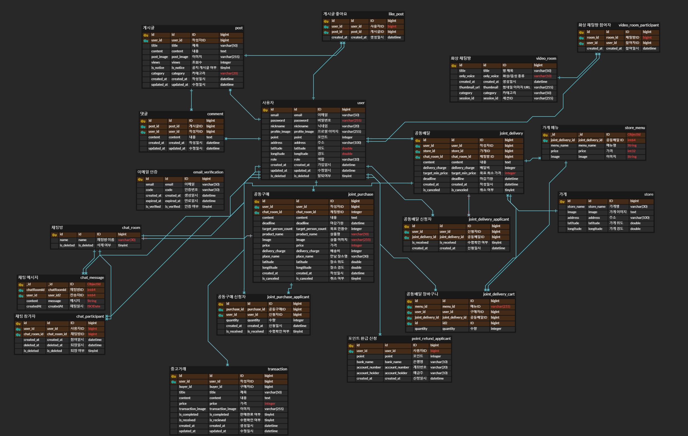

___

## 아키텍처

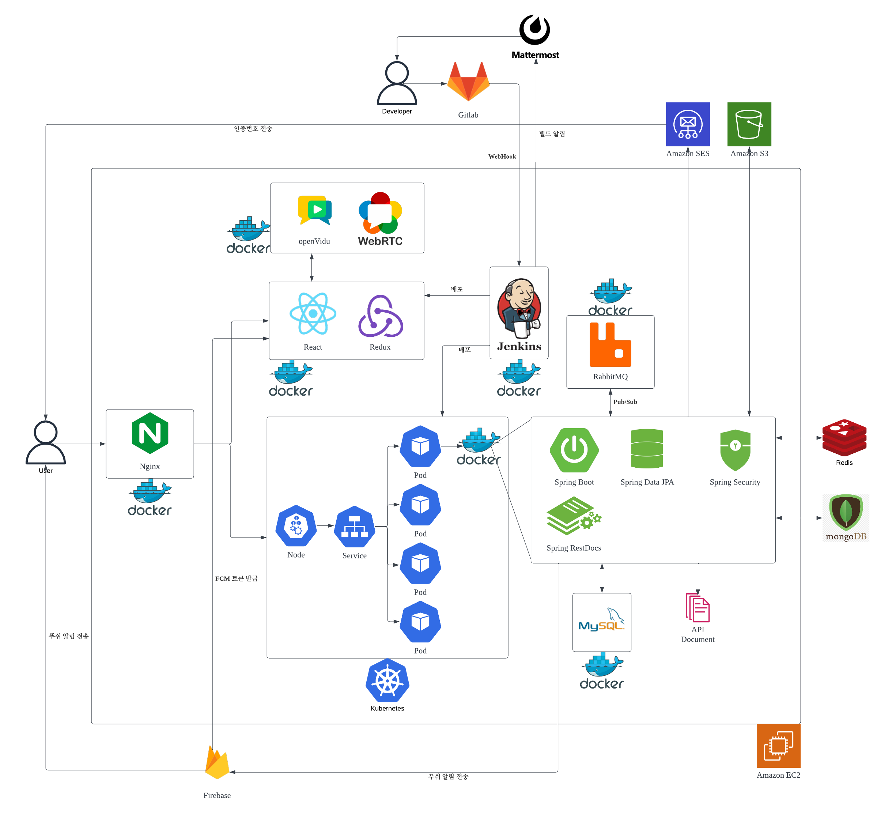

___

## [기능명세서](https://rocky-timbale-24f.notion.site/112871996ff24fb3afe58f7c80bb847c?pvs=4)

## [API 명세서](https://rocky-timbale-24f.notion.site/API-131ffc334bdd44ca9101f7d07bfb4a14?pvs=4)

## [API문서](https://honjarang.kro.kr/docs)

___

## 🗓 프로젝트 진행 기간

2023.07.04(월) ~ 2023.08.18(금) (약 7주) 

## 🏆 팀원 소개

- 김현지(팀장, FE) : 공동배달, 중고거래, 페이지 디자인

- 김재욱(FE리더) : WebRTC, 공동구매, 마이페이지, 게시판 

- 김동혁(FE) : 회원관리, 지도, 채팅

- 박세훈(BE리더) : 공동 구매, 공동 배달, 채팅, 서버 아키텍처 설계, 인프라 구축

- 이효진(BE) : 중고거래, 회원관리, 게시판

- 차재호(BE) : 리버스 프록시 구축, WebRTC, 게시판
